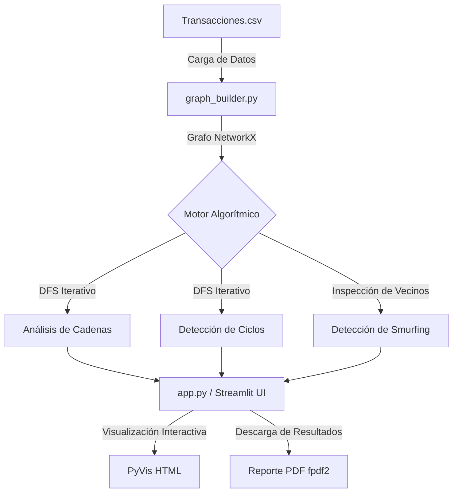

# 🏦 Sistema de Análisis de Fraude Bancario

Un sistema de detección y visualización de patrones de fraude bancario basado en grafos. Esta herramienta permite a analistas financieros cargar un historial de transacciones en formato CSV y descubrir redes de lavado de dinero, triangulaciones y evasión utilizando algoritmos de búsqueda en profundidad (DFS) e inspección de grafos.

## 🎯 Objetivo Funcional
El objetivo principal del sistema es transformar miles de filas de transacciones bancarias en un grafo interactivo para detectar automáticamente comportamientos anómalos. Se enfoca en identificar tres patrones principales de fraude:
1. **Cadenas Largas:** Dinero que pasa por múltiples cuentas rápidamente para intentar "limpiarse" y dificultar su rastreo.
2. **Ciclos (Triangulación):** Dinero que sale de una cuenta A, pasa por varias manos, y eventualmente retorna a la misma cuenta A original.
3. **Smurfing (Pitufeo):** Una cuenta distribuye grandes sumas de dinero a múltiples "mulas" (intermediarios) que luego reenvían de forma coordinada el capital a un único destino final para evadir controles anti-lavado.

## ⚙️ Arquitectura y Flujo de Datos

El sistema está diseñado de forma modular, separando la lógica matemática de la interfaz visual.



## 🚀 Instalación y Ejecución

### Prerrequisitos
- Python 3.10 o superior.
- Se recomienda el uso de un entorno virtual (`.venv`).

### 1. Clonar el repositorio y configurar el entorno
```bash
git clone https://github.com/JoaquinMaurino/Algoritmo-DFS-Fraude-Bancario.git
cd Algoritmo-DFS-Fraude-Bancario
python -m venv .venv

# Activar entorno (Windows)
.venv\Scripts\activate
# Activar entorno (Linux/Mac)
source .venv/bin/activate
```

### 2. Instalar dependencias
```bash
pip install -r requirements.txt
```

### 3. Levantar la aplicación
El sistema utiliza **Streamlit** para su interfaz gráfica web. Para iniciarlo de forma local, ejecuta en la terminal:
```bash
streamlit run app.py
```

Esto abrirá automáticamente la aplicación en tu navegador predeterminado en la dirección `http://localhost:8501`.

## 🛠️ Uso de la Aplicación

1. **Carga de Datos:** En el panel lateral izquierdo, sube tu archivo `Transacciones.csv`. Si no subes ninguno, el sistema utilizará el archivo de prueba por defecto que se encuentra en la raíz del proyecto.
2. **Parámetros Dinámicos:** En las distintas pestañas de la aplicación, podrás configurar umbrales financieros para afinar la búsqueda, tales como:
   - **Monto mínimo:** Filtra transferencias de bajo valor (ej. mayores a $10.000).
   - **Cantidad de transacciones (Hops):** Limita la profundidad de la búsqueda para acotar las redes sospechosas.
3. **Visualización:** Cada patrón de fraude detectado generará una tabla detallada y un **grafo interactivo** (se pueden arrastrar los nodos, hacer zoom, y ver detalles al posar el cursor sobre ellos).
4. **Exportación:** Desde el panel lateral, el botón **Generar Reporte PDF** consolida todas las métricas, las cadenas más largas, y el "Top 20" de cada patrón de fraude en un documento profesional listo para descargar.

## 📂 Estructura Principal del Código

- `app.py`: Punto de entrada de la aplicación UI (Streamlit).
- `src/config.py`: Definición de variables globales y umbrales (ej. el límite del 80% para Smurfing).
- `src/data/`: Lógica para transformar el dataset (`pandas`) a una estructura de grafos (`networkx`).
- `src/algorithms/`: Módulo core con el motor DFS y las reglas de negocio de fraude.
- `src/reports/`: Generador de reportes PDF usando `fpdf2`.
